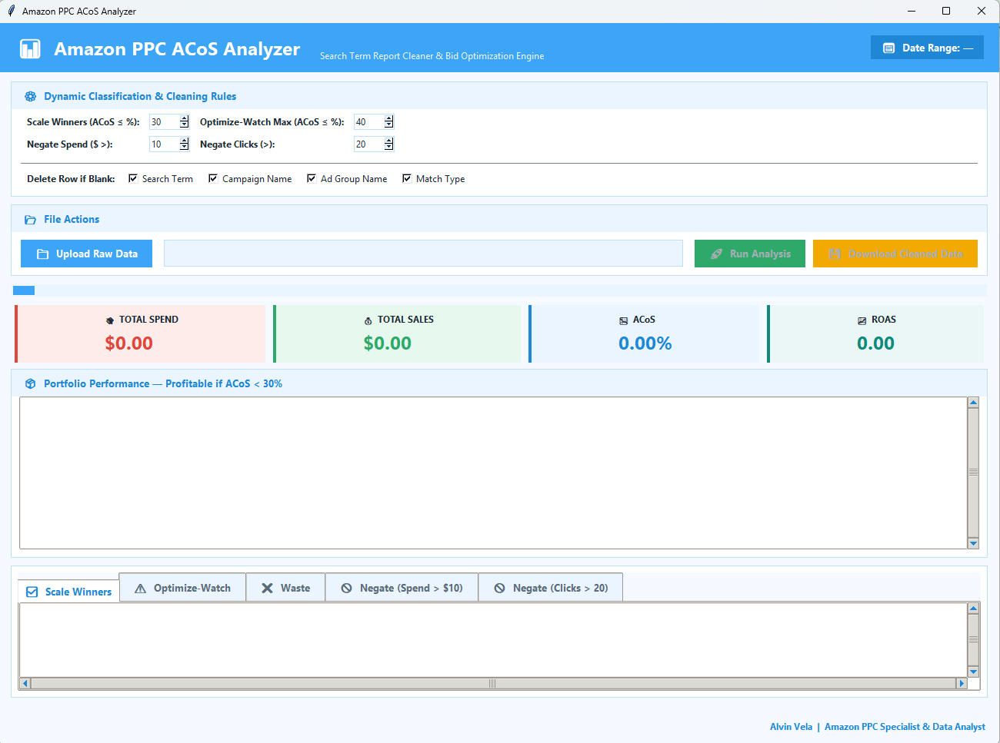
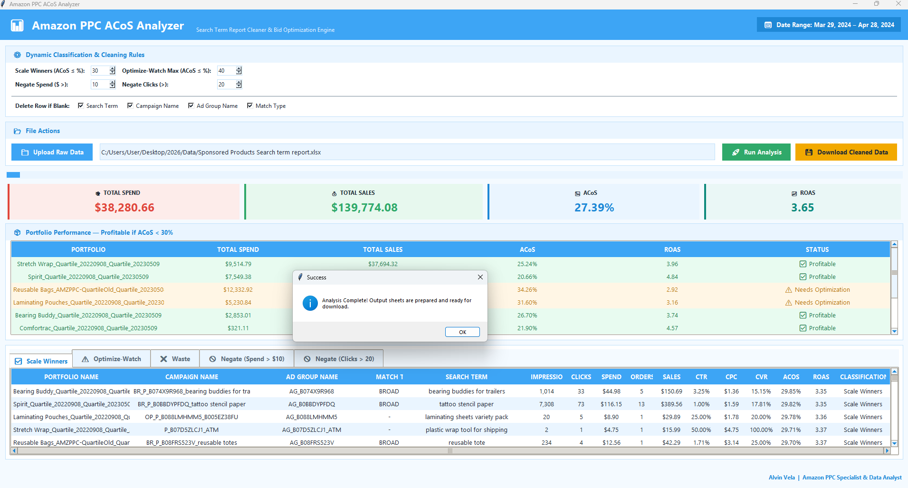
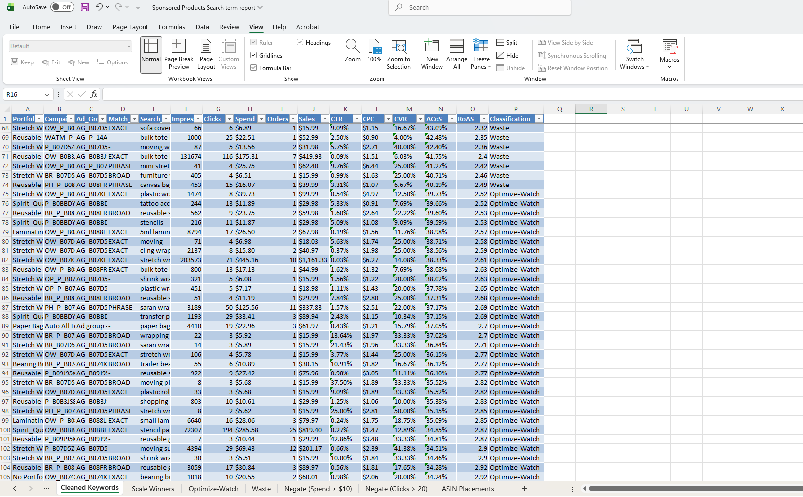

# Amazon PPC ACoS Analyzer 📊

**A Data-Driven PPC Optimization Tool — Built by an Amazon PPC Specialist with a Data Analyst's Toolkit**

This project sits at the intersection of two skill sets: hands-on Amazon Sponsored Products campaign management, and data analytics engineering (Python, SQL, Pandas, and Excel automation). It was built to solve a real problem PPC specialists face every week — manually digging through thousands of rows in a Search Term Report to find winners, waste, and negation opportunities.

Instead of eyeballing spreadsheets, this tool automates the full analytical pipeline: raw data ingestion → cleaning → KPI calculation → rule-based classification → polished, stakeholder-ready Excel output.

---

## 🎯 Why This Project Exists

As a **PPC Specialist**, I know which numbers actually drive bidding decisions (ACoS, ROAS, CTR, CVR, TACoS) and which search terms are quietly draining budget.

As a **Data Analyst**, I know how to turn that domain knowledge into a repeatable, automated system — not a one-off spreadsheet exercise, but a pipeline that can be run on any new report in minutes.

This project combines both: **PPC strategy encoded as data logic.**

---

## 🧠 Skills Demonstrated

| PPC Specialist Skills | Data Analyst Skills |
|---|---|
| Search Term Report interpretation | Python (Pandas) data cleaning pipelines |
| Bid & budget optimization strategy | KPI formula engineering (CTR, CPC, CVR, ACoS, ROAS, TACoS) |
| Negative keyword identification | Rule-based classification logic |
| Campaign structure (Exact/Broad/Phrase) | SQL-based data storage & querying |
| Match type testing & listing optimization | Automated multi-sheet Excel reporting (openpyxl) |
| Client-ready performance recommendations | Reproducible, version-controlled workflow (GitHub) |

---

## 🏗️ Directory Structure

The workflow moves from raw data ingestion, to SQL storage, to Python-based KPI calculations, to visual reporting.

```text
Amazon-PPC-ACoS-Analyzer/
│
├── data/
│   ├── raw/                  # Original Amazon Sponsored Product Search Term reports (.xlsx)
│   └── processed/            # Cleaned, structured outputs ready for analysis
│
├── python/
│   ├── main.py               # Main pipeline execution script
│   ├── data_cleaning.py      # Standardizes raw inputs & handles missing values
│   ├── kpi_calculator.py     # Calculates ACoS, ROAS, CTR, and conversion rates
│   ├── classifier.py         # Categorizes search terms (e.g., Branded vs. Generic)
│   └── export_excel.py       # Formats and exports analysis back to Excel
│
├── screenshots/              # Images used in this README
│
├── output/                   # Final business-ready Excel reports
│   └── cleaned_data.xlsx
│
├── README.md
├── requirements.txt          # Python dependencies
└── LICENSE
```

---

## 🏗️ Project Architecture

```
                  Amazon Sponsored Product Search Term Report (.xlsx)
                               │
                               ▼
                     Excel Data Validation
              (Missing Values • Duplicates • Formatting)
                               │
                               ▼
                    Python Data Cleaning (Pandas)
                               │
                               ▼
                      KPI Calculations
              CTR • CPC • CVR • ACoS • ROAS • TACoS
                               │
                               ▼
                 Search Term Classification
              Winner • Watch • Waste • Negate Keywords
                               │
                               ▼
                  Export Clean Dataset (.xlsx)
                               │
                               ▼
                   Business Recommendations
```

---

## 🎯 Goal

Automate the ingestion, cleaning, and rule-based processing of raw Amazon Search Term Reports using Python, Excel, and AI-assisted development.

Deliver multi-tab Excel workbooks formatted into native tables — combining **PPC domain rules** with **analyst-grade data engineering** — to accelerate daily bidding and optimization decisions.

---

## ❓ Questions This Project Answers

## 1️⃣ Did the April 2024 Amazon PPC campaign meet the target ACoS of less than 30%?
## 2️⃣ Which keywords are wasting advertising spend and should be optimized or negated?
## 3️⃣ How can campaign performance be improved?

---

## 📁 Data Set

Sourced from a real April 2024 Seller Central Search Term Report, this dataset is fully anonymized to protect client confidentiality while preserving genuine PPC performance signals.

## 👥 Stakeholders

Amazon Seller Account Owner • Brand Owner • Amazon PPC Manager • Amazon PPC Specialist • Amazon Virtual Assistant • Data Analyst

---


## 📊 KPI Calculations

| CTR | CPC | CVR | ACoS | ROAS | TACoS |
|-----|-----|------|------|-------|-------|
| Clicks ÷ Impressions | Spend ÷ Clicks | Orders ÷ Clicks | Spend ÷ Sales | Sales ÷ Spend | Spend ÷ Total Sales |

## 📈 Search Term Classification | Cleaning Rules

| ACoS ≤ 30% | 30% < ACoS ≤ 40% | ACoS > 40% | Spend > $10 & Sales = 0 | Clicks > 20 & Orders = 0 |
|-------------|------------------|------------|--------------------------|--------------------------|
| ✅ Scale Winners | ⚠️ Optimize / Watch | ❌ Waste | 🚫 Negate Keyword | 🚫 Negate Keyword |

---

## 🖥️ Application




## Analysis Running



## 💡 Recommendation



Based on the analysis, the project recommends:

### ✅ Scale Winners
- Increase bids
- Increase campaign budget
- Move search terms into Exact Match campaigns

### ⚠️ Optimize / Watch
- Reduce bids on high ACoS keywords
- Test new match types
- Improve product listings

### ❌ Waste / Negate
- Add Negative Keywords
- Pause consistently poor-performing keywords

---

## 🛠️ Tools & Technologies

`Python` · `Pandas` · `SQL` · `openpyxl` · `Excel` · `Amazon Seller Central` · `Git/GitHub`

---

## 📝 Disclaimer

This project was built using a hybrid approach — leveraging AI-assisted Python development combined with hands-on expertise managing live accounts as an Amazon PPC Specialist, supported by data analyst methodology for pipeline design and reporting. All client data used for testing has been fully anonymized.
