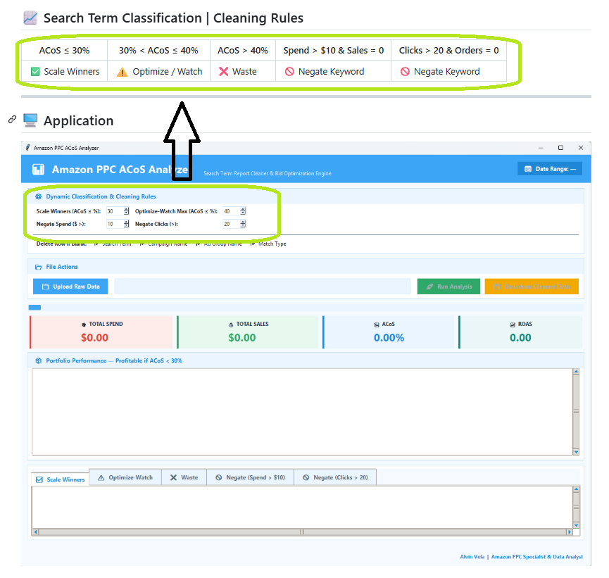

# Amazon PPC ACoS Analyzer 📊

**A Data-Driven PPC Optimization Tool — Built by an Amazon PPC Specialist with a Data Analyst's Toolkit**

This project sits at the intersection of two skill sets: hands-on Amazon Sponsored Products campaign management, and data analytics engineering (Python, SQL, Pandas, and Excel automation). It was built to solve a real problem PPC specialists face every week — manually digging through thousands of rows in a Search Term Report to find winners, waste, and negation opportunities.

Instead of eyeballing spreadsheets, this tool automates the full analytical pipeline: raw data ingestion → cleaning → KPI calculation → rule-based classification → polished, stakeholder-ready Excel output.

---

## 🎯 Why This Project Exists

As a **PPC Specialist**, I know which numbers actually drive bidding decisions (ACoS, ROAS, CTR, CVR, TACoS) and which search terms are quietly draining budget.

As a **Data Analyst**, I know how to turn that domain knowledge into a repeatable, automated system — not a one-off spreadsheet exercise, but a pipeline that can be run on any new report in minutes.

This project combines both: **PPC strategy encoded as data logic.**

---

## 🧠 Skills Demonstrated

| PPC Specialist Skills | Data Analyst Skills |
|---|---|
| Search Term Report interpretation | Python (Pandas) data cleaning pipelines |
| Bid & budget optimization strategy | KPI formula engineering (CTR, CPC, CVR, ACoS, ROAS, TACoS) |
| Negative keyword identification | Rule-based classification logic |
| Campaign structure (Exact/Broad/Phrase) | SQL-based data storage & querying |
| Match type testing & listing optimization | Automated multi-sheet Excel reporting (openpyxl) |
| Client-ready performance recommendations | Reproducible, version-controlled workflow (GitHub) |

---

## 🏗️ Directory Structure

The workflow moves from raw data ingestion, to SQL storage, to Python-based KPI calculations, to visual reporting.

```text
Amazon-PPC-ACoS-Analyzer/
│
├── data/
│   ├── raw/                  # Original Amazon Sponsored Product Search Term reports (.xlsx)
│   └── processed/            # Cleaned, structured outputs ready for analysis
│
├── python/
│   ├── main.py               # Main pipeline execution script
│   ├── data_cleaning.py      # Standardizes raw inputs & handles missing values
│   ├── kpi_calculator.py     # Calculates ACoS, ROAS, CTR, and conversion rates
│   ├── classifier.py         # Categorizes search terms (e.g., Branded vs. Generic)
│   └── export_excel.py       # Formats and exports analysis back to Excel
│
├── screenshots/              # Images used in this README
│
├── output/                   # Final business-ready Excel reports
│   └── cleaned_data.xlsx
│
├── README.md
├── requirements.txt          # Python dependencies
└── LICENSE
```

---

## 🏗️ Project Architecture

```
                  Amazon Sponsored Product Search Term Report (.xlsx)
                               │
                               ▼
                     Excel Data Validation
              (Missing Values • Duplicates • Formatting)
                               │
                               ▼
                    Python Data Cleaning (Pandas)
                               │
                               ▼
                      KPI Calculations
              CTR • CPC • CVR • ACoS • ROAS • TACoS
                               │
                               ▼
                 Search Term Classification
              Winner • Watch • Waste • Negate Keywords
                               │
                               ▼
                  Export Clean Dataset (.xlsx)
                               │
                               ▼
                   Business Recommendations
```

---

## 🎯 Goal

Automate the ingestion, cleaning, and rule-based processing of raw Amazon Search Term Reports using Python, Excel, and AI-assisted development.

Deliver multi-tab Excel workbooks formatted into native tables — combining **PPC domain rules** with **analyst-grade data engineering** — to accelerate daily bidding and optimization decisions.

---

## ❓ Questions This Project Answers

## 1️⃣ Did the April 2024 Amazon PPC campaign meet the target ACoS of less than 30%?
## 2️⃣ Which keywords are wasting advertising spend and should be optimized or negated?
## 3️⃣ How can campaign performance be improved?

---

## 📁 Data Set

Sourced from a real April 2024 Seller Central Search Term Report, this dataset is fully anonymized to protect client confidentiality while preserving genuine PPC performance signals.

## 👥 Stakeholders

Amazon Seller Account Owner • Brand Owner • Amazon PPC Manager • Amazon PPC Specialist • Amazon Virtual Assistant • Data Analyst

---


## 📊 KPI Calculations

| CTR | CPC | CVR | ACoS | ROAS | TACoS |
|-----|-----|------|------|-------|-------|
| Clicks ÷ Impressions | Spend ÷ Clicks | Orders ÷ Clicks | Spend ÷ Sales | Sales ÷ Spend | Spend ÷ Total Sales |


---

## 🖥️ Application


---

## 📌 Business Rules (Application Logic)

The Amazon PPC ACoS Analyzer automatically classifies search terms using predefined business rules based on advertising performance. These rules help identify profitable keywords, keywords that require optimization, and keywords that should be negated to reduce wasted advertising spend.

| Rule | Classification | Recommended Action |
|------|----------------|--------------------|
| **ACoS ≤ 30%** | ✅ Scale Winner | Increase bid or budget to maximize profitable sales. |
| **30% < ACoS ≤ 40%** | ⚠️ Optimize / Watch | Monitor performance and optimize bids or targeting. |
| **ACoS > 40%** | ❌ Waste | Reduce bids, pause, or review keyword relevance. |
| **Spend > $10 & Sales = 0** | 🚫 Negate Keyword | Significant spend with no sales; add as a negative keyword to prevent further wasted spend. |
| **Clicks > 20 & Orders = 0** | 🚫 Negate Keyword | High traffic but no conversions; consider adding as a negative keyword. |

## 🎯 Why These Rules?

The application automates the analysis of Amazon Search Term Reports by applying business rules to every search term. Instead of manually reviewing thousands of keywords, users receive instant recommendations to:

- 📈 Scale profitable keywords
- ⚠️ Optimize borderline-performing keywords
- ❌ Identify keywords wasting advertising budget
- 🚫 Recommend negative keywords to reduce unnecessary ad spend
- 📊 Make faster, data-driven PPC optimization decisions

> [!NOTE]
> **Configurable Business Rules**
>
> The thresholds used in this application are **not fixed**. They are fully configurable and can be customized based on each client's business objectives, profit margins, advertising budget, or PPC strategy.



> **Examples:**
> - A client targeting aggressive growth may accept an **ACoS of 35–40%**.
> - A client prioritizing profitability may require an **ACoS below 20–25%**.
> - Spend and click thresholds for keyword negation can also be adjusted.
>
> The default values in this project (**30% Target ACoS**, **40% Break-even ACoS**, **$10 Spend**, and **20 Clicks**) are sample business rules and can be modified to meet different client requirements.


---


## Analysis Running


## 💡 Cleaned Excel Report


---
## 📊 Business Solution

The application transforms raw Amazon Sponsored Products Search Term Reports into a **business-ready Excel solution** by combining **Amazon PPC expertise** with **data analytics**.

Through an automated workflow, the application:

- 🧹 Cleans and validates raw PPC data
- 📊 Calculates key performance indicators (CTR, CPC, CVR, ACoS, ROAS, and TACoS)
- 🏷️ Classifies search terms using configurable business rules
- 💡 Generates actionable insights and PPC optimization recommendations
- 📁 Exports a stakeholder-ready Excel report for decision-making

The final report enables **Amazon PPC Specialists**, **Brand Owners**, and **Amazon Sellers** to:

- ✅ Identify profitable keywords to scale
- ⚠️ Detect keywords that require optimization
- 🚫 Reduce wasted advertising spend through negative keyword recommendations
- 📈 Improve campaign performance and profitability
- 🎯 Make faster, data-driven campaign optimization decisions with confidence

---

## 🛠️ Tools & Technologies

`Python` · `Pandas` · `SQL` · `openpyxl` · `Excel` · `Amazon Seller Central` · `Git/GitHub`

---

## 📝 Disclaimer

This project was built using a hybrid approach — leveraging AI-assisted Python development combined with hands-on expertise managing live accounts as an Amazon PPC Specialist, supported by data analyst methodology for pipeline design and reporting. All client data used for testing has been fully anonymized.
